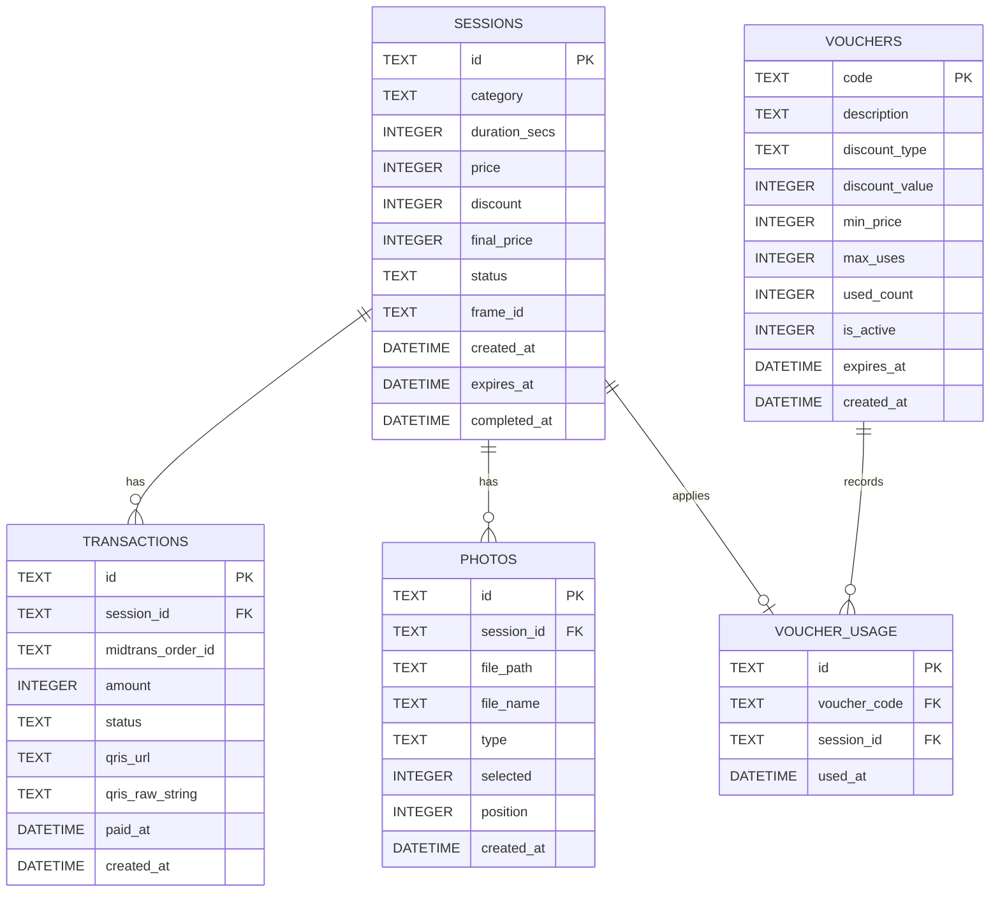

# Database Schema

Skema ini mengikuti tabel yang dipakai backend saat ini.

## Ringkasan Tabel

### sessions
Menyimpan status utama sesi photobooth, harga awal, diskon, harga akhir, dan masa berlaku sesi.

### transactions
Menyimpan transaksi Midtrans atau transaksi gratis untuk satu sesi.

### photos
Menyimpan file foto mentah dan foto hasil komposisi per sesi.

### vouchers
Menyimpan master voucher, batas penggunaan, minimum pembelian, dan masa berlaku.

### voucher_usage
Mencatat voucher yang sedang dipakai oleh sebuah sesi.
